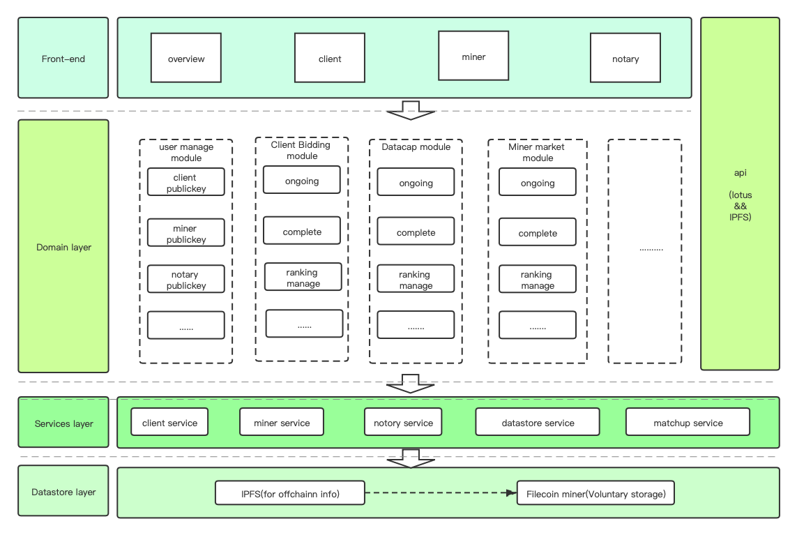

# filmatchup

[Chinese](./Readme_CN.md)

## Background
At the current stage of  the Filecoin network, there is no good system support for the matching process before customers and miners start deals on the chain.

- For customers, it looks for miners for data storage, basically in slack channels or other media to publish information publicly, this method is still relatively primitive.
- For miners, they are relatively passive in obtaining customer information, basically maintaining offline activities or even not carrying out activities.
- For notaries, how to give customers the corresponding datacap also relies on more subjective factors to judge, and the degree of customer tracking obtained by datacap is not comprehensive enough.

The current behaviors of the above roles in the filecoin network are relatively lack of sufficient objective and comprehensive information and activity platforms. The complexity of information acquisition will reduce the heat of the transaction to a certain extent.

## Ideas for the filecoin deals matching system
Build a decentralized deals matching market
- Obtain comprehensive miners and their service information (including on-chain information and off-chain information)
- Obtain comprehensive customer needs and their transaction information (including on-chain information and off-chain information)
- Provide fair and objective data for the notary's datacap distribution, and reduce the weight of the notary's subjective judgment

Customers, miners, and notaries can easily complete operations on the system
The transaction matching system counts the information on and off the chain, and provides objective judgment data for the reputation system; the reputation system not only provides the reputation of miners, but also the reputation of customers and notaries.

## Technical framework concept

## spec (ongoing)
[spec](./doc/spec.md)

## The current stage of the project

Discussion and design phase
