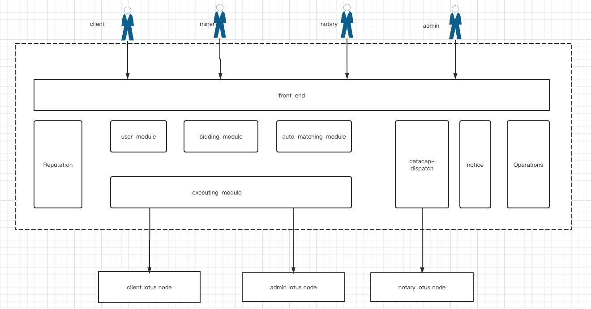

## Functionality and Features

### 

The features are as follows.

| Number |           Module           | Features                                                     | Notes |
| ------ | :------------------------: | :----------------------------------------------------------- | ----- |
| 1      |        User module         | (1)  User login  (2)  Real-name authentication  (3)  Third-party account binding  (4)  AccessKey/AccessSecret generation ( indirect access to lotus node)  (5)  Roles management (user with different role owns different pages)  |       |
| 2      |   DataCap  distribution    | (1)  Apply to notaries to receive DataCap (include show the reputation scores at present, allocation policy, service contract,  etc.) (2) Audit request from clients manually  (3)  DataCap allocation policy  setting  and auto approved  (4)  DataCap allocation list: when/who/How much   |       |
| 3      |       Bidding module       | (1)  client -- Bid Invitation management:  list,create, delete, modify, publish, cancel  (2)  miner -- Bidding management : list, modify,cancel            (3)  bids status display: published, finished, aborted,   discarded (4)  After the transaction, client and miner will give review and score to each other. (Including default review strategy, etc.)                                                                                                                                                              (5) After the transaction, complaints can be made against rule-violating acts by listing up evidences.    |       |
| 4      |  Auto matching-up policy   | (1)   Policy for client          - miner blacklist         - miner candidate's  reputation scores          - miner candidate's   max price         - miner candidate's  regions          - miner candidate's  longest completion time   (2)  Policy for miner         - client's  reputation scores in the bid        - client's  min price in the bid          - client's  region  in the bid          - client's shortest  completion time   in the bid  (3)  Priority configuration：clients are able to configure the  priority  of selection conditions  (4)  The system's default policy         -  If there are multiple miner candidates in the shortlist,  the new miner will be the first choice.    |       |
| 5      |     Execution  module      | (1)   Manual execution    (2)   Auto execution  configuration   |       |
| 6      |     Reputation module      | A basic reputation system based on real-name authentication, third-party account binding, miners' computing power, miners' fault conditions, mutual evaluation between transaction parties, and registration time |       |
| 7      |   Communication channel    | (1) Announcement display (2) User message               |       |
| 8      | Operations and managements | (1) Announcement management (2) Message List  (3) reputation policy management (4) Complaints  management  (4) System parameters  configuration  |       |

