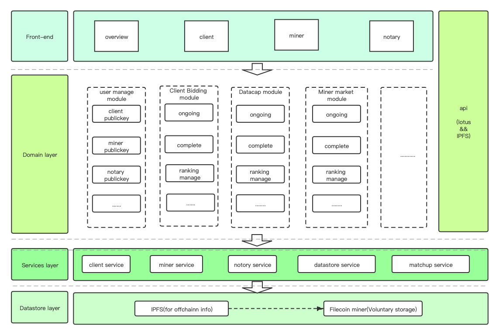

# filmatchup spec

##  Architecture summary

## Domain layer

- Business logic realization

  
### user manager module

- Use the public key to log in, and all off-chain matching processes require its signature to ensure all matching evidence chains.

  

## Datastore layer

- the offchain matchup info is be stored to IPFS and Filecoin,Ensure that the data off-chain is not tampered with.

- Miners can voluntarily help store matching data off-chain, which can be used as a bonus indicator in the miner reputation dimension.