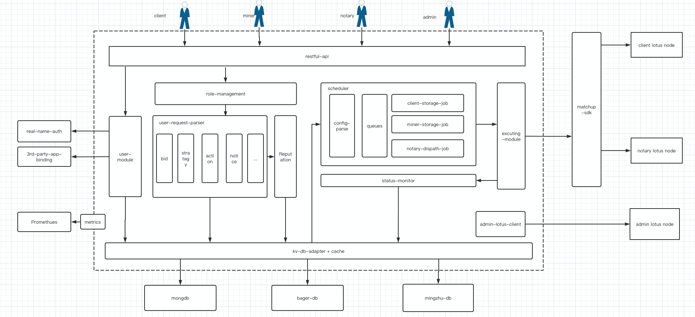

## Technology Architecture

### 

- RESTful-api  is the entrance of the system to provide services to the outside world.

-  User login/authentication/binding/roles is managed in the user-module

- It will be routed to different sub-business modules according to the user role after the user logs  in 

- The request can be  parsed in every business sub-module,  and the parser is unified

- Build reputation based on user module's basic information and user behavior

- Additions, deletions and modifications to the database are all soft operations, physically appended based on existing data

- Client deals, miner storage, and notary datacap allocation all involve on-chain behavior and are asynchronous

- On-chain operation records can be loaded  from the database and then executed by the scheduler

- Use matchup-SDK as an anti-corrosion layer to isolate user lotus nodes  so that we  do not have direct  access to  them, which  set user's mind at rest

- Monitor the progress of chain-related operations

- Admin users need to connect to their own lotus nodes to verify the signature and obtain relevant on-chain information.

 

